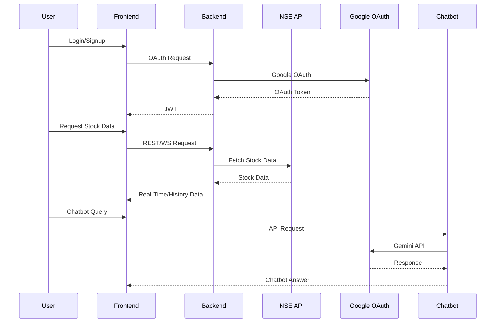
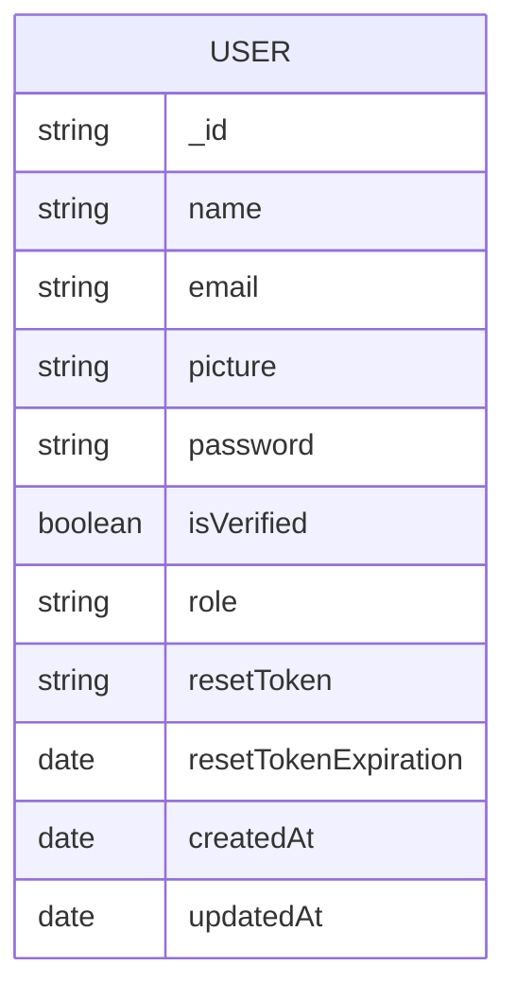

# FinBud - Real-Time Stock Tracking & Financial Platform

## Tech Stack

- **Frontend:** Next.js
- **Backend:** Node.js / Express.js

- **All Tech:** Next.js, Redux-Toolkit, MUI, Node.js, Express.js, JWT, Socket.io, Redis, MongoDB, TypeScript

## Overview

- Developed a user-friendly FinBud platform with **Next.js** and included **Google Login** for simpler user access.

- A backend using **Node.js**, **Socket.io**, **Redis**, and **MongoDB** that receives Real-Time stock data from NSE India.

- Access **Real-Time** and **Historical** data for NSE India, along with **Market Status** and the ability to Search for NSE stocks.

- **AI-powered** financial assistant using Google Gemini API to help users understand market trends and make informed decisions.

## Key Features

- **Real-time Stock Tracking:** Get live stock data from NSE India with automatic updates.
- **Historical Data Analysis:** View and analyze historical stock data for the past 7, 10, 20, or 30 days.
- **Candlestick Charting:** Interactive charts displaying OHLC (Open, High, Low, Close) data.
- **Market Status Indicator:** Know instantly whether markets are open or closed.
- **Stock Search:** Find stocks easily with our powerful search functionality.
- **Google Authentication:** Secure login and registration using Google OAuth.
- **FinBud Assistant:** AI-powered chatbot for financial advice and market insights.
- **Responsive Design:** Optimized user experience across all devices.

## Project Setup

Please follow the instructions below to setup the project:

### Clone the Repository

First, we need to clone the repository. Open your terminal, navigate to your desired directory, and run the following command:

```
git clone https://github.com/mujibsayyad/Stock-Trading-Platform.git
```

### Navigate into the Project Directory

Once cloning is complete, navigate into the new project directory with this command:

- Navigate to client folder

```
cd client
```

- Navigate to server folder

```
cd server
```

### Install Dependencies

Now we'll install the project's dependencies. Make sure you have Node.js installed on your machine. To install the dependencies, run the following command:

```
npm install
```

or

```
yarn
```

### Set Up Environment Variables

The project requires some environment variables to function properly. Create the following files:

#### Client Environment (.env.local in client directory)

```
NEXT_PUBLIC_BACKEND_URL = 'http://localhost:5001'
NEXT_PUBLIC_GOOGLE_CLIENT_ID = 'YOUR_GOOGLE_CLIENT_ID'
NEXT_PUBLIC_GOOGLE_REDIRECT_URI = 'http://localhost:5001/api/sessions/oauth/google'
GOOGLE_API_KEY = 'YOUR_GOOGLE_GEMINI_API_KEY'
```

#### Server Environment (.env in server directory)

```
DB = 'YOUR_MONGODB_CONNECTION_STRING'
PORT = 5001
PRIVATE_KEY = 'YOUR_JWT_SECRET_KEY'
CLIENT_DOMAIN = 'http://localhost:3000'

# Google OAuth Configuration
GOOGLE_CLIENT_ID = 'YOUR_GOOGLE_CLIENT_ID'
GOOGLE_CLIENT_SECRET = 'YOUR_GOOGLE_CLIENT_SECRET'
GOOGLE_OAUTH_REDIRECT_URL = 'http://localhost:5001/api/sessions/oauth/google'
```

### Set Up Google OAuth (Required for Authentication)

To enable Google authentication, you need to set up OAuth credentials:

1. Go to the [Google Cloud Console](https://console.cloud.google.com/)
2. Create a new project or select an existing one
3. Navigate to "APIs & Services" > "Credentials"
4. Click "Create Credentials" > "OAuth client ID"
5. Select "Web application" as the application type
6. Add a name for your OAuth client
7. Add the following Authorized redirect URIs:
   - `http://localhost:5001/api/sessions/oauth/google`
8. Click "Create"
9. Copy the Client ID and Client Secret
10. Add these values to your environment files:
    - Client ID goes in both client and server .env files
    - Client Secret goes in the server .env file only

### Set Up Gemini API (For FinBud Assistant)

To enable the AI-powered financial assistant:

1. Go to the [Google AI Studio](https://ai.google.dev/)
2. Create an API key for Gemini
3. Add the API key to your client's .env.local file as GOOGLE_API_KEY

### Start the Development Server

Finally, start the development server with this command:

```
npm run dev
```

or

```
yarn dev
```

- The client side runs at `http://localhost:3000` or a different port if `3000` is already in use.

- The server side runs at `http://localhost:5001` or a different port if `5001` is already in use.

---

# 📚 Project Documentation & Architecture

## 📦 Project Structure

```
/Stock-Trading-Platform
├── client/         # Next.js frontend
│   └── src/app/    # Main app logic, pages, components, hooks, utils
├── server/         # Node.js/Express backend
│   └── src/        # Controllers, models, routes, middlewares, utils
├── README.md       # Project documentation
└── ...
```

## 🏗️ High-Level Architecture

```mermaid
flowchart LR
    A[Frontend (Next.js, Redux, MUI)] <--> B[Backend (Express, Socket.io, Redis, MongoDB)]
    B <--> C[NSE India API]
    B <--> D[Google OAuth]
    A <--> E[Chatbot (Streamlit, Gemini API)]
```

## 🔄 Data Flow



## 🗄️ Database Entity-Relationship Diagram (ERD)



## 📝 Key Features

- Real-time and historical stock data for NSE India
- Google OAuth login
- JWT-based authentication
- Real-time updates via Socket.io
- Charting and analytics (candlestick, historical)
- Financial advisor chatbot (Streamlit + Gemini API)

## 🧩 Main Components

- **Frontend:**
  - `Navbar`, `HomePage`, `StockGrid`, `ChartPage`, `GoogleLogin`, `ChatbotWidget`
- **Backend:**
  - `auth.ts`, `stocks.ts`, `ping.ts` (controllers)
  - `userSchema.ts` (Mongoose user model)
  - `fetchStockData.ts` (NSE data processing)

## 🤖 FinBud Assistant

- Streamlit app (`chatbot.py`)
- Integrates with Google Gemini API for financial Q&A
- Supports PDF, image, audio, video chat
- Provides personalized insights based on viewed stocks

---

> **Diagrams are written in [Mermaid](https://mermaid-js.github.io/mermaid/#/) format. You can preview them in supported markdown editors or use [Mermaid Live Editor](https://mermaid.live/).**
