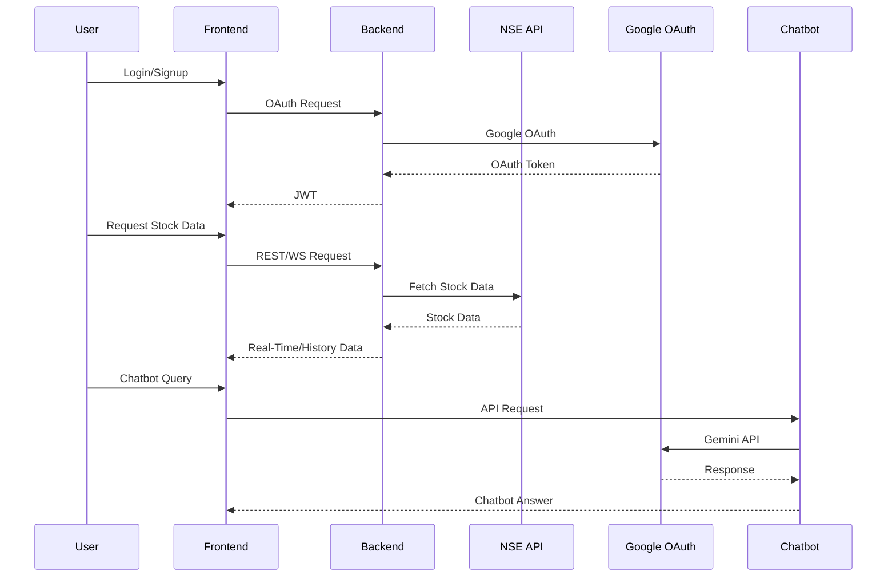
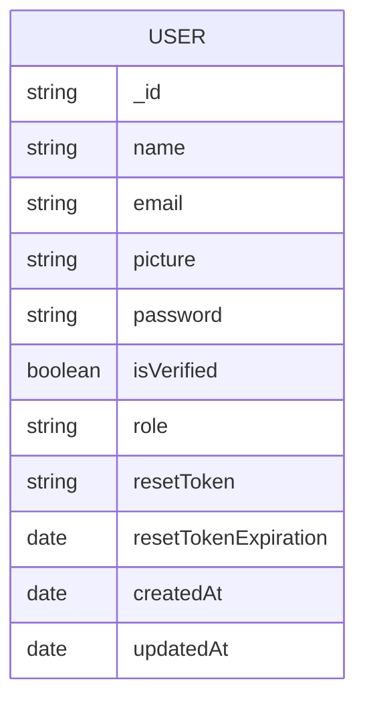

# Real-Time Stock Trading Platform

## Tech Stack

- **Frontend:** Next.js
- **Backend:** Node.js / Express.js

- **All Tech:** Next.js, Redux-Toolkit, MUI, Node.js, Express.js, JWT, Socket.io, Redis, MongoDB, TypeScript

## Overview

- Developed a user-friendly Stock Trading Platform with **Next.js** and included **Google Login** for simpler user access.

- A backend using **Node.js**, **Socket.io**, **Redis**, and **MongoDB** that receives Real-Time stock data from the NSE India.

- Access **Real-Time** and **Historical** data for NSE India, along with **Market Status** and the ability to Search for NSE stocks.

## Project Setup

Please follow the instructions below to setup the project:

### Clone the Repository

First, we need to clone the repository. Open your terminal, navigate to your desired directory, and run the following command:

```
git clone https://github.com/mujibsayyad/Stock-Trading-Platform.git
```

### Navigate into the Project Directory

Once cloning is complete, navigate into the new project directory with this command:

- Navigate to client folder

```
cd client
```

- Navigate to server folder

```
cd server
```

### Install Dependencies

Now we'll install the project's dependencies. Make sure you have Node.js installed on your machine. To install the dependencies, run the following command:

```
npm install
```

or

```
yarn
```

### Start the Development Server

Finally, start the development server with this command:

```
npm run dev
```

or

```
yarn dev
```

- The client side runs at `http://localhost:3000` or a different port if `3000` is already in use.

- The server side runs at `http://localhost:5000` or a different port if `5000` is already in use.

---

# 📚 Project Documentation & Architecture

## 📦 Project Structure

```
/Stock-Trading-Platform
├── client/         # Next.js frontend
│   └── src/app/    # Main app logic, pages, components, hooks, utils
├── server/         # Node.js/Express backend
│   └── src/        # Controllers, models, routes, middlewares, utils
├── README.md       # Project documentation
└── ...
```

## 🏗️ High-Level Architecture

```mermaid
flowchart LR
    A[Frontend (Next.js, Redux, MUI)] <--> B[Backend (Express, Socket.io, Redis, MongoDB)]
    B <--> C[NSE India API]
    B <--> D[Google OAuth]
    A <--> E[Chatbot (Streamlit, Gemini API)]
```

## 🔄 Data Flow



## 🗄️ Database Entity-Relationship Diagram (ERD)



## 📝 Key Features

- Real-time and historical stock data for NSE India
- Google OAuth login
- JWT-based authentication
- Real-time updates via Socket.io
- Charting and analytics (candlestick, historical)
- Financial advisor chatbot (Streamlit + Gemini API)

## 🧩 Main Components

- **Frontend:**
  - `Navbar`, `HomePage`, `StockGrid`, `ChartPage`, `GoogleLogin`, `ChatbotWidget`
- **Backend:**
  - `auth.ts`, `stocks.ts`, `ping.ts` (controllers)
  - `userSchema.ts` (Mongoose user model)
  - `MarketDataFeed.proto` (NSE data structure)

## 🤖 Chatbot

- Streamlit app (`chatbot.py`)
- Integrates with Google Gemini API for financial Q&A
- Supports PDF, image, audio, video chat

---

> **Diagrams are written in [Mermaid](https://mermaid-js.github.io/mermaid/#/) format. You can preview them in supported markdown editors or use [Mermaid Live Editor](https://mermaid.live/).**
