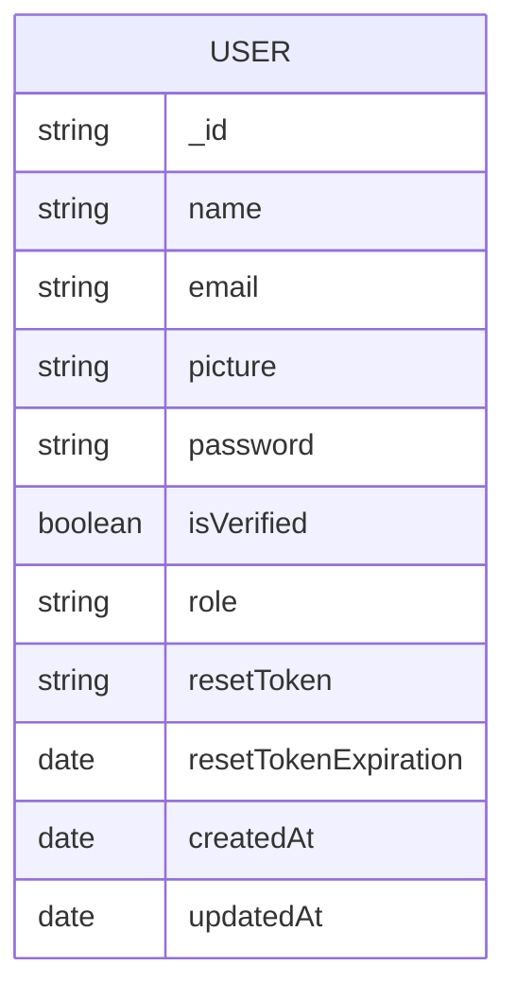
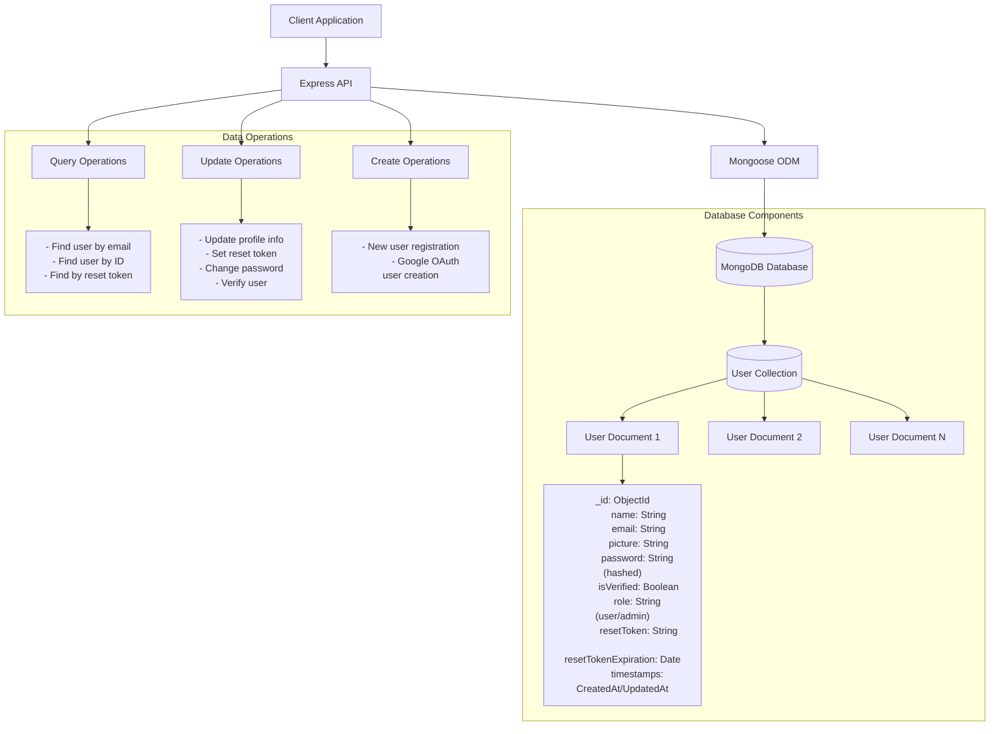
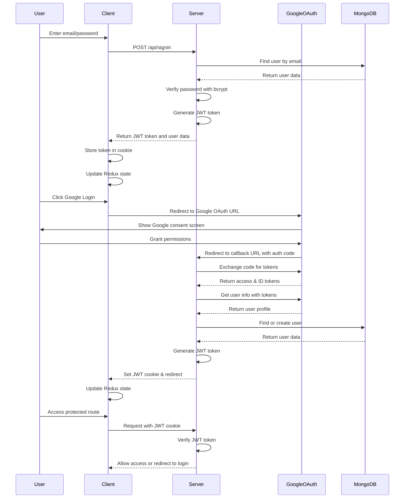

# FinBud - System Diagrams

## Database Schema

```mermaid
erDiagram
    USER {
        string _id
        string name
        string email
        string picture
        string password
        boolean isVerified
        string role
        string resetToken
        date resetTokenExpiration
        date createdAt
        date updatedAt
    }
```

## Database Architecture Flowchart

```mermaid
flowchart TD
    Client[Client Application] --> API[Express API]
    API --> Mongoose[Mongoose ODM]
    Mongoose --> MongoDB[(MongoDB Database)]

    subgraph Database Components
        MongoDB --> UserCollection[(User Collection)]

        UserCollection --> UserDoc1[User Document 1]
        UserCollection --> UserDoc2[User Document 2]
        UserCollection --> UserDocN[User Document N]

        UserDoc1 --> Fields1["
            _id: ObjectId
            name: String
            email: String
            picture: String
            password: String (hashed)
            isVerified: Boolean
            role: String (user/admin)
            resetToken: String
            resetTokenExpiration: Date
            timestamps: CreatedAt/UpdatedAt
        "]
    end

    subgraph Data Operations
        Query[Query Operations] --> Find["
            - Find user by email
            - Find user by ID
            - Find by reset token
        "]

        Update[Update Operations] --> UpdateOps["
            - Update profile info
            - Set reset token
            - Change password
            - Verify user
        "]

        Create[Create Operations] --> CreateOps["
            - New user registration
            - Google OAuth user creation
        "]
    end

    API --> Query
    API --> Update
    API --> Create
```

## Authentication Flow

```mermaid
sequenceDiagram
    participant User
    participant Client
    participant Server
    participant GoogleOAuth
    participant MongoDB

    %% Regular Email/Password Login
    User->>Client: Enter email/password
    Client->>Server: POST /api/signin
    Server->>MongoDB: Find user by email
    MongoDB-->>Server: Return user data
    Server->>Server: Verify password with bcrypt
    Server->>Server: Generate JWT token
    Server-->>Client: Return JWT token and user data
    Client->>Client: Store token in cookie
    Client->>Client: Update Redux state

    %% Google OAuth Flow
    User->>Client: Click Google Login
    Client->>GoogleOAuth: Redirect to Google OAuth URL
    GoogleOAuth->>User: Show Google consent screen
    User->>GoogleOAuth: Grant permissions
    GoogleOAuth->>Server: Redirect to callback URL with auth code
    Server->>GoogleOAuth: Exchange code for tokens
    GoogleOAuth-->>Server: Return access & ID tokens
    Server->>GoogleOAuth: Get user info with tokens
    GoogleOAuth-->>Server: Return user profile
    Server->>MongoDB: Find or create user
    MongoDB-->>Server: Return user data
    Server->>Server: Generate JWT token
    Server-->>Client: Set JWT cookie & redirect
    Client->>Client: Update Redux state

    %% Token Validation
    User->>Client: Access protected route
    Client->>Server: Request with JWT cookie
    Server->>Server: Verify JWT token
    Server-->>Client: Allow access or redirect to login
```
